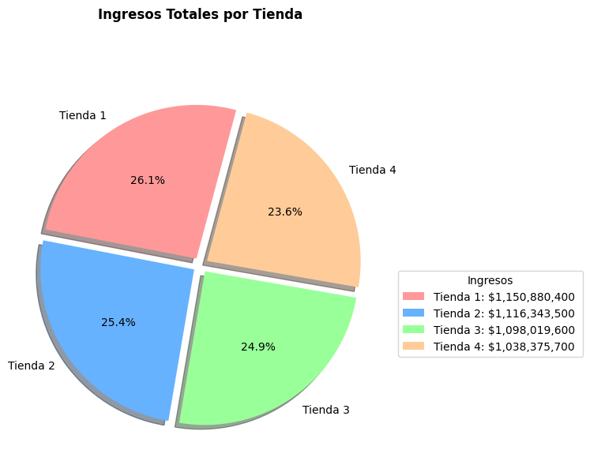
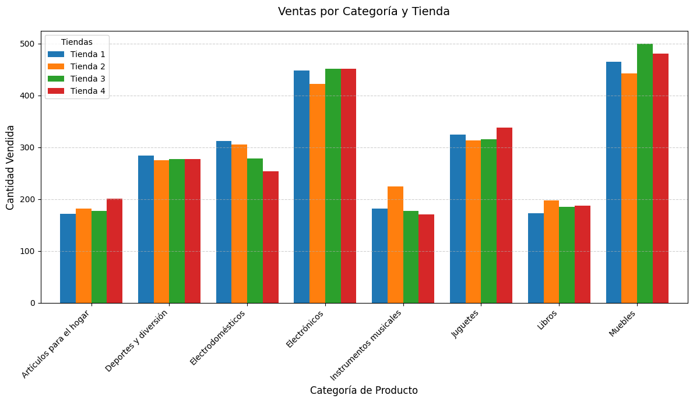

# Alura-Latam-Practicando-Python-para-Data-Science-Challenge-Alura-Store

Este es un desafio propuesto por alura latam, el cual nose dejara desarrollar nuestra habilidades en Python. 
# 📊 Análisis de Desempeño de Tiendas - Recomendación de Cierre

Este repositorio contiene un análisis exploratorio de datos realizado para evaluar el desempeño de cuatro tiendas ficticias, con el objetivo de determinar cuál de ellas debería cerrarse como estrategia de optimización operativa.

## 📌 Objetivo

A partir de métricas clave como ingresos totales, satisfacción del cliente, costo promedio de envío, productos más vendidos y ventas por categoría, se busca identificar la tienda con menor rendimiento general.

## 🧪 Análisis Incluido

- ✅ **Ingresos Totales por Tienda**
- ✅ **Evaluación de Clientes (Calificación y Número de Reseñas)**
- ✅ **Costo Promedio de Envío**
- ✅ **Top 5 Productos Más y Menos Vendidos**
- ✅ **Ventas por Categoría de Producto**

### 📈 Gráficos

#### Ingresos Totales por Tienda


#### Ventas por Categoría y Tienda


## 📂 Estructura del Proyecto

```plaintext
/
└── Alura-Latam-Practicando-Python-para-Data-Science-Challenge-Alura-Store
    ├── tienda_analysis.ipynb          # Notebook con el análisis realizado
    ├── report.md                      # Informe con los resultados del análisis
    ├── README.md                      # Este archivo de documentación
    └── base-de-datos-challenge1-latam/
        ├── tienda_1.csv               # Datos de la Tienda 1
        ├── tienda_2.csv               # Datos de la Tienda 2
        ├── tienda_3.csv               # Datos de la Tienda 3
        └── tienda_4.csv               # Datos de la Tienda 4
```

## 📈 Insights Obtenidos

# Insignias Obtenidas

1. **Análisis de Datos con Python**  
   - **Descripción**: Uso de **NumPy** para el análisis de grandes volúmenes de datos y cálculos matemáticos.  
   - **Valor**: Demuestra habilidad en la manipulación de datos y optimización de cálculos.

2. **Desarrollo de Soluciones con Frameworks**  
   - **Descripción**: Uso de un **framework** en Python para estructurar y mejorar la eficiencia del análisis.  
   - **Valor**: Resalta la capacidad para desarrollar soluciones escalables y optimizadas.

---

## 🚀 Cómo Ejecutar el Notebook en Google Colab

Puedes abrir y ejecutar el análisis fácilmente desde Google Colab:

👉 [Abrir en Google Colab](https://colab.research.google.com/drive/1nkY3aWAPCpCCtDitE6NWU7nLn8kSE5qB#scrollTo=SzpQb7rVCLWK)

### Pasos:

1. Haz clic en el enlace de arriba.
2. Inicia sesión con tu cuenta de Google (si no lo has hecho).
3. Ejecuta las celdas del notebook (una por una o con “Ejecutar todo”).

> El análisis se realiza usando archivos CSV que se cargan automáticamente desde URLs públicas, por lo que no necesitas subir ningún archivo manualmente.

---


## 🧾 Conclusión del Estudio

Con base en los datos recolectados y analizados, se recomienda **cerrar la Tienda 4**, ya que:

- Tiene los **menores ingresos**.
- Comparte productos con otra tienda (Tienda 1), lo cual genera **redundancia**.
- No se destaca en calificaciones ni en categorías de alta rentabilidad.
- Su bajo costo de envío no compensa el bajo desempeño general.

## 🛠️ Tecnologías Usadas

- Python
- Pandas
- Coolab(Google)
- Markdown

---

Hecho con 💻 por Francisco Javier Cervantes Mendieta
